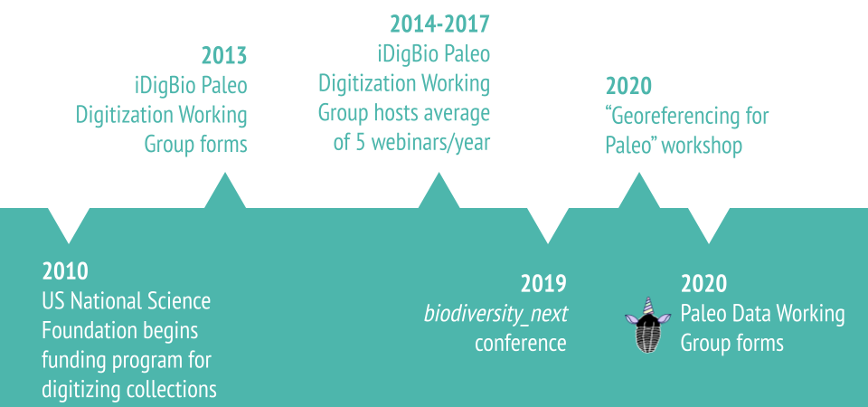
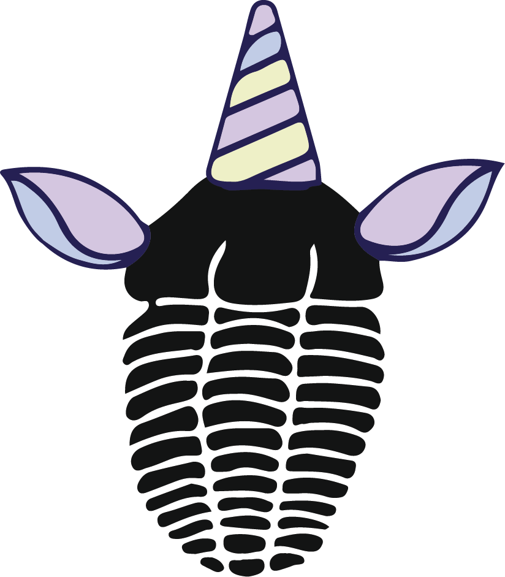

The Paleo Data Working Group was launched in May 2020 as a driving force for broader conversations about paleontological data standards and integration of fossil data into larger data ecosystems. We are a community of practice centered around collections-based paleo and informatics professionals. Activities include regular meetings, workshops, community outreach, and engagement with parallel groups and processes. We also maintain a documentation pipeline for carrying conversation through to community resources and guidelines.

This group formed as a result of a decade of increasing collaboration between paleontology professionals digitizing their collections, including as part of an earlier [Paleo Digitization Working Group](https://www.idigbio.org/wiki/index.php/Paleo_Digitization_Working_Group) hosted by iDigBio. Members of the group come from a wide range of institutions, including independent museums to university collections to representatives from US federal agencies. Currently members of this group are largely US-based, though with some international (and very welcome) participation.

### List of institutions and people involved

- Academy of Natural Sciences of Drexel University (ANSP) - [Alejandra Martinez-Melo](https://orcid.org/0000-0003-2314-689X)
- Indiana University, Bloomington (IUB) – [Jess Miller-Camp](https://orcid.org/0000-0003-4143-9514)
- Museum of Comparative Zoology, Harvard University (MCZ) – [Christina Byrd](https://orcid.org/0000-0001-7963-6092)
- Natural History Museum of Los Angeles County (NHMLA / LACM ) - [Juliet Hook](https://orcid.org/0000-0003-0485-1112)
- North Carolina Museum of Natural Sciences (NCMNS) – [Ben Norton](https://orcid.org/0000-0002-5819-9134), Susan Edelstein
- Paleontological Research Institute (PRI) – Vicky Wang
- University of Colorado Museum of Natural History (CUMNH) - [Talia Karim](https://orcid.org/0000-0001-6514-963X), [Jacob Van Veldhuizen](https://orcid.org/0000-0001-6770-0181)
- University of Kansas Natural History Museum & Biodiversity Institute - [Natalia López Carranza](https://orcid.org/0000-0002-1393-2902) (KUMIP), [Lindsay Walker](https://orcid.org/0000-0002-2162-6593) (Symbiota)
-  University of St. Thomas, St. Paul, MN - [Thomas Hickson](https://orcid.org/0000-0002-7878-3565)
- Sam Noble Oklahoma Museum of Natural History (SNOMNH) – [Margaret Landis](https://orcid.org/0000-0002-3297-9888), [Roger Burkhalter](https://orcid.org/0000-0001-5518-5661)
- Santa Cruz Museum of Natural History (SCMNH) - [Wayne Thompson](https://orcid.org/0000-0002-2603-0510)
- Smithsonian National Museum of Natural History (NMNH) - [Holly Little](https://orcid.org/0000-0001-7909-4166), [Amanda Millhouse](https://orcid.org/0000-0002-8679-4774), [Jessie Nakano](https://orcid.org/0000-0002-7652-3663), [Kathy Hollis](https://orcid.org/0000-0002-4875-0594), Matt Miller
- Stanford University (LSJU) – [Chrissy Garcia](https://orcid.org/0000-0002-9728-3670)
- University of Wisconsin Geology Museum (UWGM) – [Carrie Eaton](https://orcid.org/0000-0001-6647-1751)
- Yale Peabody Museum (YPM) – [Jessica Utrup](https://orcid.org/0000-0001-5201-8235)
- independent, [Erica Krimmel](https://orcid.org/0000-0003-3192-0080)

### What is your logo??

Our logo is of our working group mascot, the trilocorn (i.e. a trilobite + a unicorn). The trilocorn lives and thrives in our souls, encouraging us to be the best data and collections managers we can be. You could consider the trilocorn to be the patronus of paleo collections, protecting their staff against the slippery slope of data chaos.
